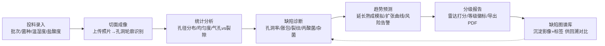

## 1. 产品概述

面向手工奶酪坊的一站式发酵成像与质量分级生产力工具，通过数字化采集菌种参数、切面图像AI识别、孔洞特征量化、缺陷智能诊断与趋势预测，替代传统经验判断，实现每轮奶酪从投料→成像→诊断→预测→分级的全流程可追溯质量管理。

- 核心价值：将"老师傅的眼睛和经验"固化为可量化、可复现、可追溯的科学指标体系
- 目标用户：手工奶酪坊的生产主管、质检人员、发酵工艺师

## 2. 核心功能

### 2.1 用户角色
| 角色 | 注册方式 | 核心权限 |
|------|----------|----------|
| 生产主管 | 默认账号 | 全流程操作、报告导出、历史查询 |
| 质检人员 | 默认账号 | 成像诊断、缺陷标注、分级确认 |
| 工艺师 | 默认账号 | 参数调整、趋势分析、图谱维护 |

### 2.2 功能模块（5大核心页面 + 1个导航总览）
1. **投料录入页**：批次信息、菌种产气量、熟成温湿度、盐度酸度录入
2. **切面成像页**：照片上传/示例图、孔洞轮廓识别、大小分布统计、气孔/裂隙区分
3. **缺陷诊断页**：孔洞率达标判定、早期胀包/晚期裂纹识别、丙酸菌活性推算、盐酸度校验、缺陷图谱
4. **趋势预测页**：熟成天数延长模拟、孔洞扩张趋势曲线、过度发酵风险告警
5. **分级报告页**：孔洞品相打分、成品等级（A/B/C级）、分级报告生成与导出

### 2.3 页面详情
| 页面名称 | 模块名称 | 功能描述 |
|-----------|-------------|---------------------|
| 投料录入页 | 批次头部卡片 | 轮次编号、奶酪品种、生产日、熟成天数（步进器+输入） |
| 投料录入页 | 菌种参数区 | 菌种下拉、理论产气量滑块、实测产气量输入、接种量 |
| 投料录入页 | 温湿度曲线 | 多阶段温湿度配置表（阶段名/温度/湿度/时长）+ 迷你折线图 |
| 投料录入页 | 盐度酸度区 | 盐度%输入、pH值输入、滴定酸度°D、杂菌产气抑制校验提示 |
| 投料录入页 | 保存与继续 | 校验必填、保存批次、跳转成像 |
| 切面成像页 | 图像工作台 | 左侧上传区（拖拽/点击/示例图切换）、右侧Canvas叠加识别层 |
| 切面成像页 | 孔洞识别控制 | 识别阈值滑块、最小孔径过滤、运行识别按钮、进度条 |
| 切面成像页 | 统计面板 | 孔洞总数、平均直径、直径分布直方图（6档：微/小/中/大/超大/裂隙） |
| 切面成像页 | 均匀度指标 | 空间分布热力图、Gini均匀度系数、变异系数CV |
| 切面成像页 | 分类图例 | 正常气孔（圆形蓝绿）、裂隙缝隙（长条红橙）、点击图例可高亮筛选 |
| 缺陷诊断页 | 孔洞率仪表盘 | 实测孔洞率% / 目标区间、达标判定（大勾/大叉+色带） |
| 缺陷诊断页 | 缺陷识别面板 | 早期胀包（皮下大泡）标记、晚期裂纹（放射/网状）定位、缺陷计数与占比 |
| 缺陷诊断页 | 丙酸菌活性卡 | 活性指数（0-100）、与孔洞形成时间轴映射（接种→启孔→扩孔→稳定四阶段） |
| 缺陷诊断页 | 盐酸度校验 | 盐度→酸度→杂菌产气风险矩阵热力图、抑制是否合格 |
| 缺陷诊断页 | 缺陷图谱区 | 历史相似缺陷缩略图网格（带标签）、点击放大对比 |
| 趋势预测页 | 模拟控制面板 | 延长天数滑块（+3/+7/+14/+21/+30天）、温度调整、置信度 |
| 趋势预测页 | 扩张趋势曲线 | 多折线图：平均孔径/孔洞率/异常孔占比 随天数变化，当前位竖线标记 |
| 趋势预测页 | 过度发酵告警 | 风险分级（绿/黄/橙/红四级）、触发阈值说明、建议措施卡片 |
| 趋势预测页 | 时间演变影像 | 4张阶段模拟切面图（当前/+3/+7/+14）带孔洞扩张高亮动画 |
| 分级报告页 | 品相打分雷达图 | 6维度：孔洞率、均匀度、正常孔占比、无缺陷率、尺寸达标、色泽一致性 |
| 分级报告页 | 等级徽标 | A级（特级·金）/B级（优·银）/C级（合格·铜）大徽标、综合得分 |
| 分级报告页 | 报告正文 | 批次信息总览、关键指标表、诊断结论、改进建议、质检签名位 |
| 分级报告页 | 导出操作 | 导出PDF/打印、保存至图谱库、生成分享二维码 |

## 3. 核心流程

奶酪生产批次从投料建档开始，经历温湿度监控→切面采样→AI识别孔洞→多维度缺陷诊断→发酵趋势推演→最终质量分级，形成闭环。所有批次的影像与诊断数据沉淀为缺陷图谱，用于辅助后续批次的对比诊断。

## 4. 用户界面设计

### 4.1 设计风格
- **视觉主题**：乳脂暖调 × 实验室精密感，命名为「乳品实验室」风格
- **主色**：`#C9A66B` 奶酪金（primary）— 呼应奶酪本身的琥珀色泽
- **辅色**：`#4A7C59` 菌藻绿（secondary，代表发酵/健康）；`#B33951` 酒红（alert，代表缺陷）
- **中性底**：`#FAF6EF` 奶油米背景 + `#2B2A27` 墨棕正文，避免纯白刺眼
- **按钮**：4px微圆角 + 奶酪金细描边，悬浮时上移2px + 柔光投影
- **字体**：标题使用「思源宋体」体现匠人质感；正文使用「Inter」保障数据可读性
- **布局**：左侧垂直导航（固定220px，奶油米+细金线），右侧内容区使用卡片网格（卡片有金线边框与细腻阴影）
- **图标**：Lucide图标统一描边，关键按钮搭配奶酪🧀、气孔⚪、裂纹💔、发酵📈、等级🏅emoji点缀

### 4.2 页面设计概览
| 页面名称 | 模块名称 | UI元素 |
|-----------|-------------|-------------|
| 导航总览 | 侧栏导航 | 垂直5项+当前页金线高亮、底部当前批次号显示、顶部Logo（奶酪图标+系统名） |
| 投料录入页 | 表单卡片 | 金边线框卡片、分组标题带小绿点、滑块带刻度标签、表格斑马纹（米/奶油交替） |
| 切面成像页 | 双栏工作台 | 左上传区（虚线金框+拖拽态高亮）、右Canvas（SVG叠加识别框）、底统计卡6格 |
| 缺陷诊断页 | 仪表盘矩阵 | 中心孔洞率大仪表（半圆+指针+色带）、四象限缺陷卡（胀包/裂纹/活性/盐酸度）、底图谱网格 |
| 趋势预测页 | 模拟面板 | 顶部滑块控制台、中AreaChart（渐变填充绿→红）、下4帧时间演变图带过渡动画 |
| 分级报告页 | 报告样式 | 顶部大徽标（A/B/C不同色）、左雷达图、右指标表、底部签名区 + 右侧悬浮导出条 |

### 4.3 响应式
- 桌面优先（≥1280px），侧栏固定展开
- 平板（768-1279px）：侧栏折叠为图标条，卡片改为2列
- 移动端（<768px）：侧栏变底部Tab、卡片单列、图像区上下堆叠
