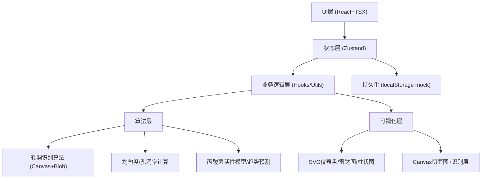
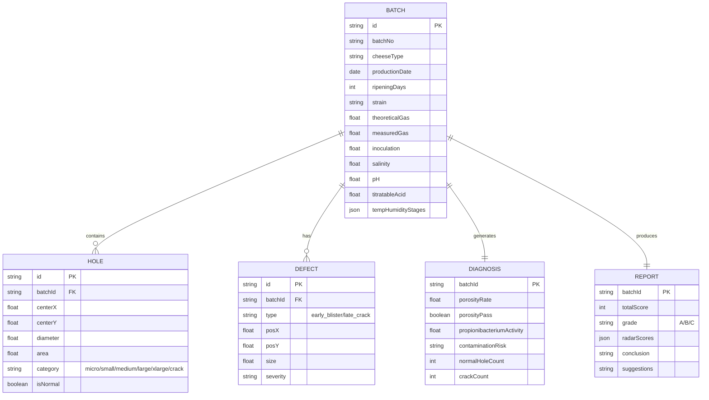

## 1. 架构设计

纯前端单页应用（SPA）架构，所有图像识别算法、统计计算与报告生成都在浏览器端运行，无需后端服务。生产数据通过 localStorage 持久化，图表使用 SVG Canvas 渲染，保证离线可用（手工奶酪坊网络不稳定场景）。



## 2. 技术说明

- **前端框架**：React 18 + TypeScript 5 + Vite 5
- **样式方案**：TailwindCSS 3 + 自定义CSS变量（乳品实验室主题色板）
- **状态管理**：Zustand（轻量、支持分块、无Provider嵌套）
- **路由**：React Router v6（hash模式，兼容file://直开）
- **图表可视化**：原生SVG手写（仪表盘/雷达/柱图/折线），避免引入大型图表库
- **图像处理**：原生Canvas 2D + ImageData，实现孔洞Blob识别
- **图标**：lucide-react
- **后端**：无，纯前端，所有数据mock + localStorage持久化

## 3. 路由定义

| Route | 页面 | 说明 |
|-------|------|------|
| `/` | 投料录入页 | 默认页，填写批次参数 |
| `/imaging` | 切面成像页 | 上传照片+孔洞识别+统计 |
| `/diagnosis` | 缺陷诊断页 | 孔洞率/缺陷/丙酸菌/图谱 |
| `/trend` | 趋势预测页 | 模拟延长熟成+风险告警 |
| `/report` | 分级报告页 | 雷达打分+等级徽标+导出 |

## 4. 数据模型

### 4.1 ER关系



## 5. 核心算法（前端实现）

| 算法 | 说明 |
|------|------|
| 孔洞Blob识别 | Canvas转灰度→二值化（可调阈值）→轮廓提取→最小外接圆→计算直径/圆度（区分裂隙：圆度<0.3或长宽比>2.5） |
| 孔洞率 | 所有孔面积之和 / 切面总面积 |
| Gini均匀度 | 将切面网格化统计各格孔数，计算Gini系数 |
| 丙酸菌活性指数 | 综合产气量×0.4 + 正常孔占比×0.3 + 平均孔径达标度×0.3 |
| 扩张趋势模拟 | 基于温度系数×天数系数的Logistic增长模型，预测孔径随天数变化 |
| 综合打分 | 6维雷达加权平均：孔洞率25% + 均匀度20% + 正常占比20% + 无缺陷率15% + 尺寸达标10% + 色泽10% |

## 6. 项目目录结构

```
src/
├── components/
│   ├── layout/           # Sidebar导航、卡片容器
│   ├── forms/            # 投料表单组件、温湿度阶段编辑器
│   ├── imaging/          # 图像上传区、识别Canvas、孔洞统计图
│   ├── diagnosis/        # 仪表盘、缺陷定位、丙酸菌时间轴、盐酸度矩阵
│   ├── trend/            # 模拟控制、趋势折线、风险告警条、演变影像
│   └── report/           # 雷达图、等级徽标、报告正文、导出按钮
├── pages/
│   ├── InputPage.tsx
│   ├── ImagingPage.tsx
│   ├── DiagnosisPage.tsx
│   ├── TrendPage.tsx
│   └── ReportPage.tsx
├── hooks/
│   ├── useBatchStore.ts      # Zustand批次状态
│   ├── useHoleDetection.ts   # 孔洞识别hook
│   └── useTrendSimulation.ts # 趋势模拟hook
├── utils/
│   ├── holeAlgorithms.ts     # Blob/孔洞率/Gini算法
│   ├── trendModel.ts         # 丙酸菌/扩张预测
│   ├── gradingScoring.ts     # 打分与分级
│   └── mockData.ts           # 初始Mock批次数据
├── types/
│   └── index.ts              # BATCH/HOLE/DEFECT等类型定义
├── App.tsx
├── main.tsx
└── index.css
```
